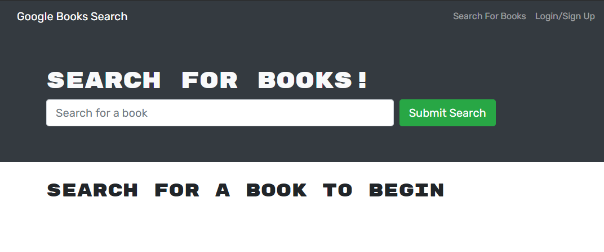
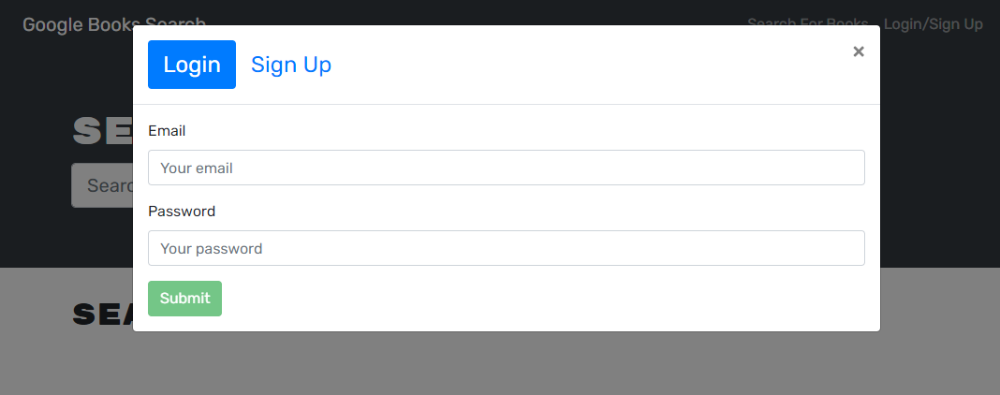
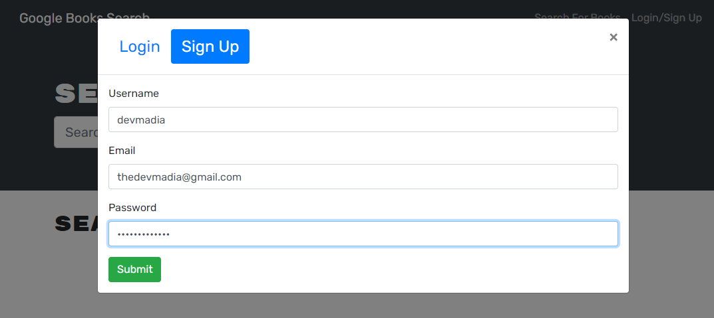
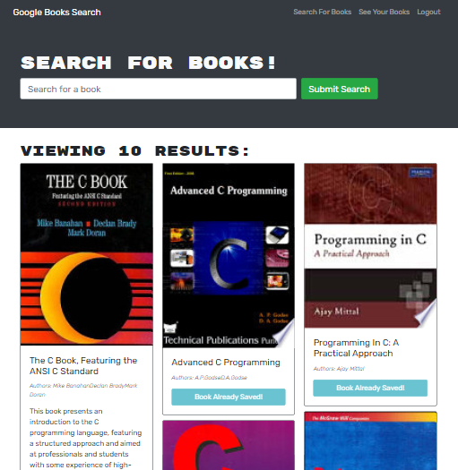
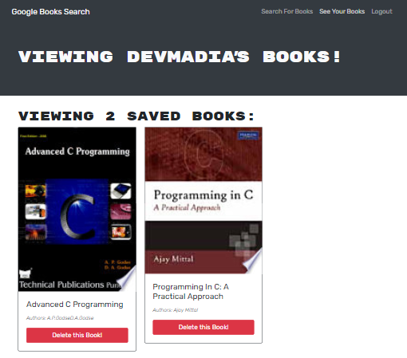

# ABookSearchEngine

## Description
A MERN stack, with a React front end, MongoDB databse and Node.js/Express.js server and API application utilizing Google Books API search engine. Users can search for and save books they want to read or purchase at a later date.

## Table of Contents
  - [Description](#description)
  - [Installation](#installation)
  - [Usage](#usage)
  - [License](#license)
  - [Contributing](#contributing)
  - [Resources](#resources)
  - [Questions](#questions)

## Installation
Download a copy of this repo to a directory of your choice. To install, you will need to run `npm i` or `npm install` to get all the dependencies running. Following proper installation of the dependencies, you will type `npm start` on the root directory terminal to start the server.

## Usage
Upon successful deployment of the server, the application will run locally on the following address: http://localhost:3001/

Within the application, either run on the website or from the extension download available, a user can then utilize the application for their own purposes regarding the saving of books through the Google Books API to read or purchase at a later date.

The following screenshot is the fully deployed website available here: https://grisly-treat-69547.herokuapp.com/

Upon first visit, a user will see the above and need to make an account to fully utilize the web application services.

User is greeted with the ability to Login if an account already exists.

First time visitors will find the signup form easy to read and upon successful account creation, they are automatically ported to the logged in site for ease of use. Passwords are hidden from view for an added layer of security.

Users can then search for their choice of books and select an easy to see blue button to `Save This Book!` to their profile. Confirmation of a book being saved is rendered by the button updating to say `Book Already Saved!`. Users will need to navigate to their profile to remove books from their list.

Once done with their search, a user may review items by selecting the `See Your Books` link at the top right corner. It will redirect to a page with a count of how many books are displayed below. To remove a book from the profile's list, users can click the red button `Delete this Book!`.

## License
This project is covered by the MIT license. 

## Contributing
At this time, Devmadia is not interested in contributors to this application.

## Resources
1. [Node.js](https://nodejs.org/en/)
2. [Express](https://www.npmjs.com/package/express)
3. [Bootstrap](https://www.npmjs.com/package/bootstrap)
4. [Apollo Server](https://www.npmjs.com/package/apollo-server-express)
5. [JSON Web Token](https://www.npmjs.com/package/jsonwebtoken)
6. [GraphQL](https://www.npmjs.com/package/graphql)
7. [Mongoose](https://www.npmjs.com/package/mongoose)
8. [MongoDB Atlas](http://wwww.mongodb.com/)
9. [React](https://www.npmjs.com/package/react)
10. [React Router Dom](https://www.npmjs.com/package/react-router-dom)
11. [Heroku](https://www.heroku.com)

## Questions
Visit my GitHub: 

If you have any additional questions not answered here or wish to contact me regarding developments, please email me at 
[thedevmadia@gmail.com](mailto:thedevmadia@gmail.com)
